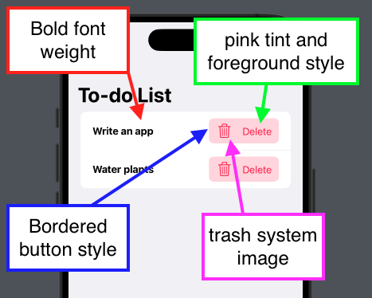
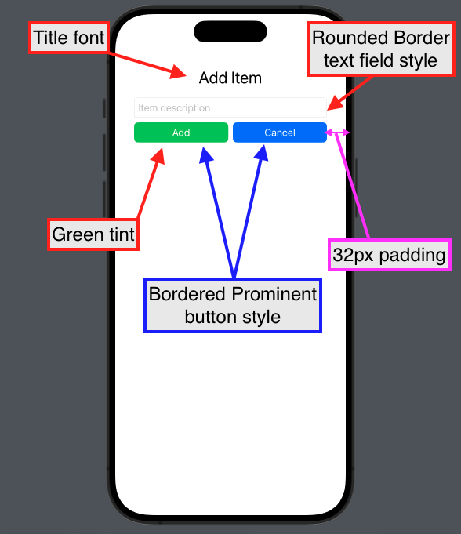

[← Module 4](https://github.com/gtiosclub/bootcamp-module-4) • [Module 6 →](https://github.com/gtiosclub/bootcamp-module-6)

# Module 5: Intro to SwiftUI

In this module, you'll be learning the basic building blocks of building a UI
in Swift.

#### What you'll accomplish:

- [ ] Load elements of an array as items in a scrollable list

- [ ] Add interactivity to an app using closures

- [ ] Add styling to UI components using view modifiers

- [ ] Build structured UI layouts using Views

## Getting Started

- Clone the repo on to your local device
    - You can do this via Xcode or the command line
- If the project isn't already open, navigate to the project folder and
  open up `SimpleTodo.swiftpm`
- Run the project to make sure everything is loaded properly.
- There should be no errors and you should be able to see the preview.
    - If for some reason you can't get previews working, run the app in the
      simulator instead
    
## Step 0: Understanding the app logic

Navigate to ContentView and wait until the preview or simulator loads.

Before we start coding, take a look at the `todoListDemo()` function in
ContentView. Try to make an educated guess on what's going on.

In the preview/simulator, click the "Demo" button in the upper right corner.

You should see some output in the console displaying some to-do list operations
being performed and the final result.

The app logic is controlled by a view model called `todoLogic` of type
TodoViewModel. This handles all the backend operations, which allows you to
focus on coding the UI. You'll learn about this concept in a couple weeks.

For now, let's direct our attention to the ContentView struct.

## Step 1: Displaying list items

Take a look at the current implementation of ContentView, along with the
tasks that need to be done.

Follow the instructions so that your app is able to show a list of to-do items.

Take a look at 
[this article](https://developer.apple.com/documentation/swiftui/foreach)
if you're having trouble with using a ForEach block.

You may also want to refresh yourself on the concept of Closures since it's
necessary to implement the `deleteAction` of TodoItemView.

#### What you've accomplished so far:

- [x] Load elements of an array as items in a scrollable list

- [x] Add interactivity to an app using closures

## Step 2: Styling a component

Now that you have a working to-do list, you may notice that the list items
look a little... boring. Let's fix that.

Navigate to the TodoItemView file.

You can see that it contains two variables: `item` and `deleteAction`.
You should be familiar with what these do from the previous step.

Here, all the views are already declared. You just need to use view modifiers
to style the components.

Using view modifiers, style the components so it meets
the guideline below:

#### What you've accomplished so far:

- [x] Load elements of an array as items in a scrollable list

- [x] Add interactivity to an app using closures

- [x] Add styling to UI components using view modifiers

## Step 3: Building layouts

Now that you've styled TodoItemView such that it conforms to the guideline,
let's take a look at the view used to add items.

First, run the app in the simulator or navigate to the preview for ContentView.

Try opening the add item view by clicking the + button in the top right corner.

It's technically functional, but quite visually unappealing.

Now, navigate to AddItemView and take a look at the instructions.

Create the necessary views and view modifiers to make AddItemView conform to
the guideline below:

## Conclusion

Now try running the app in the simulator.

You've just made a to-do list app which not only works, but looks pretty good
as well!

#### What you've accomplished today:

- [x] Load elements of an array as items in a scrollable list

- [x] Add interactivity to an app using closures

- [x] Add styling to UI components using view modifiers

- [x] Build structured UI layouts using Views
